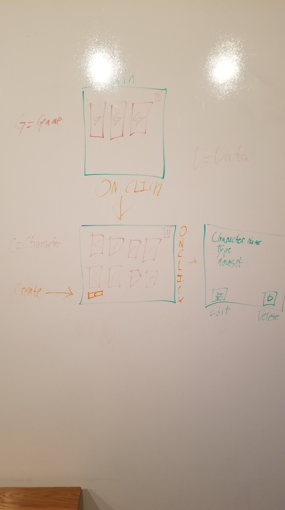
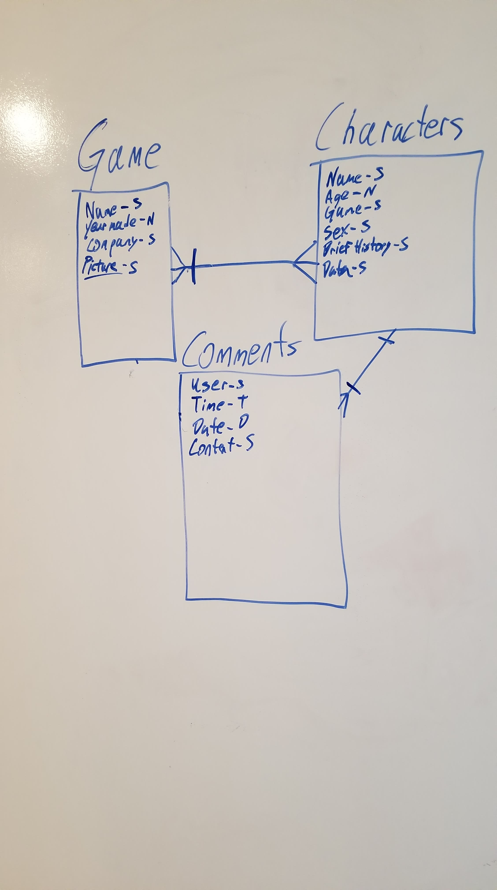

#Description

A system where you can enter in specific games and specific character information. It allows the users to make a small collection of knowledge for later use.

This is built with Handlebars, Javascript, and CSS.

#App

https://whispering-anchorage-81670.herokuapp.com/

#Trello

https://trello.com/b/aNJd2Yuz/unit-2-project-character-data

#Wireframe

#Data Relations

#Tech/Libraries/Frameworks

JS Library : Moment.js

Flex-box

Game Logos and Character Portraits provided by Google and official art rips

#version 2 revision

Add in animations, add in 'game sounds', User/Admin log in to prevent deletion of games if needed, editting comments based on users, cleaner mobile version.

#shoutouts

Dezrin - Debugging

Cam/Taylor - General help due to lack of knowledge of the material.

Chad - Encouragement and advice in the right direction.